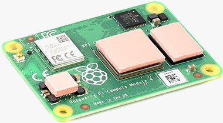
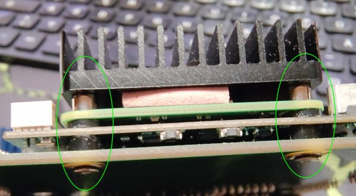
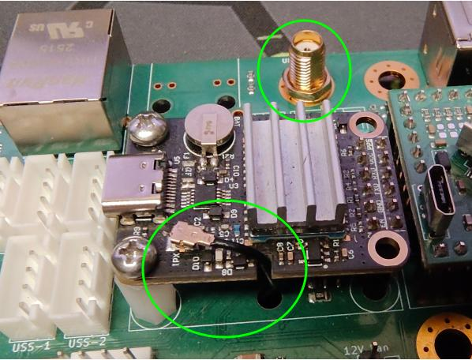
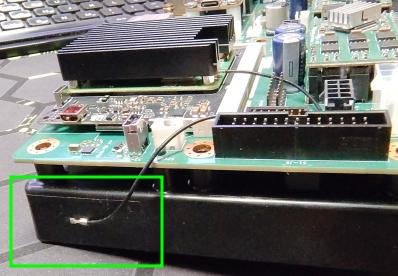
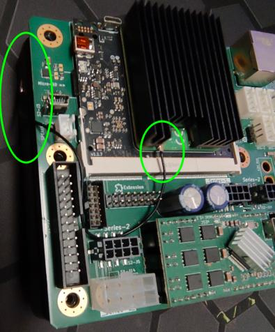
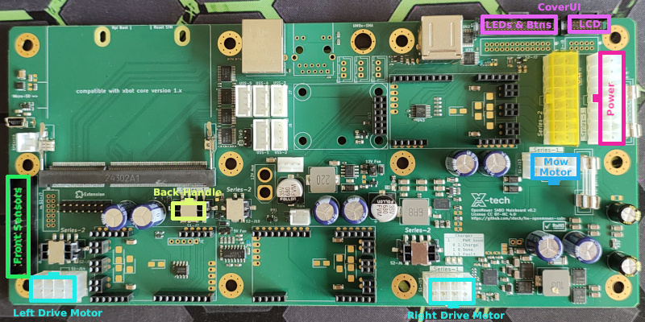
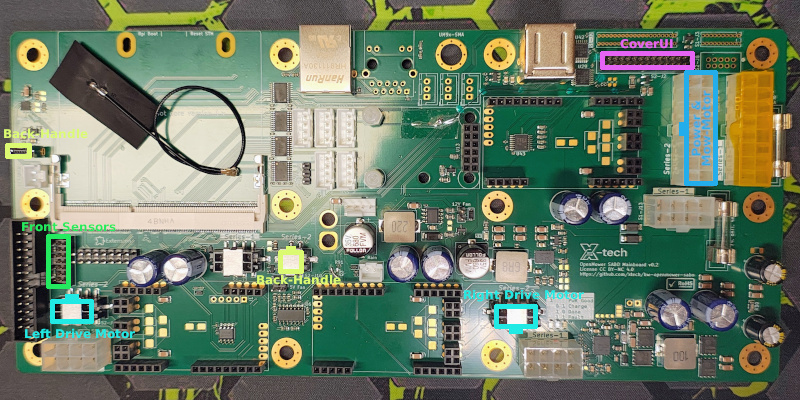
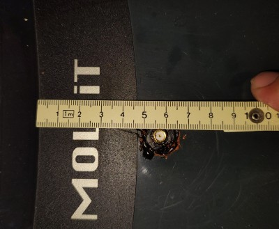
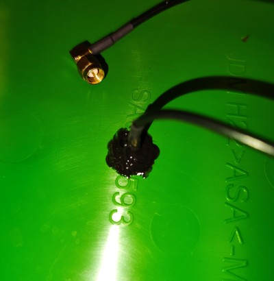

# Hardware Installation and Software Preparation Guide 🛠️🛰️

This guide describes the hardware installation and the software preparation steps required during installation for the OpenMower‑V2 Carrierboard for SABO mowers.

## Scope 🎯

- Primary focus: mechanical/electrical installation of the Carrierboard and modules (xCore + CM4, UM9x, antennas, connectors) inside the mower.
- Included: software preparation that must be performed during hardware install (flashing OpenMowerOS onto CM4, first boot, basic connectivity checks).
- Not included: the full software setup, ESC calibration and ROS configuration. For those steps, see INSTALL-SOFTWARE.md.

## At a glance (process overview) 🧭

1) Open the mower and remove the OEM mainboard.
2) Prepare xCore & CM4 (flash OpenMowerOS; first boot; verify Wi‑Fi/SSH/WebApp).
3) Prepare the UM9x RTK module.
4) Install the Wi‑Fi adhesive antenna.
5) Assemble the Carrierboard and the mainboard holder; connect plugs.
6) Install the HA/HX‑901 GPS antenna on the cover; seal outside and inside.
7) Close the housing and finish assembly.

## 1. Open the mower and remove the OEM mainboard 🔓

1. Place the mower on its back and remove the six 10 mm screws from the housing.
2. Remove the blade with the 5mm Allen key (right‑hand thread). Use gloves and secure the blade while loosening.
3. Hold the housing together with both hands and place the mower back on its wheels.
4. Slightly open the cover on the handle (rear) side by a few centimeters.
5. Using a flashlight, disconnect the display ribbon cable(s):
   - Series‑I: two ribbon cables going to the CoverUI. Each plug has small side locks; press to release, then unplug from the mainboard.
   - Series‑II: one ribbon cable; pull it straight out from the mainboard (no release locks).
6. You can now open the cover further. A single cable from the cover’s charging contacts goes toward the mainboard. Before the mainboard there is a 2‑pin Molex plug; press to unlock and disconnect it. Put the cover aside for later modification and reassembly.
7. Disconnect all remaining cables from the OEM mainboard. Many plugs have a latch; press to release before pulling.
8. The OEM mainboard is mounted on a black plastic mainboard holder. On its back side are two larger Torx T30 screws. Remove them to lift out the mainboard together with the holder.
9. Remove the OEM mainboard from the holder by unscrewing the Torx T20 screws.

## 2. Prepare xCore & CM4 🧩

1. Optional: Waveshare CM4‑Heatsink‑B (SKU 22097)
   - Place the small standoffs on the xCore’s CM4 mounting holes.
2. Carefully seat the Raspberry Pi CM4 onto the xCore connector. Ensure the orientation is correct (the small IPEX antenna connector aligns appropriately with the SODIMM side).

3. Download the latest OpenMowerOS_\<YYYYMMDD>.zip asset from [OpenMowerOS Releases](https://github.com/ClemensElflein/OpenMowerOS/releases).
   
4. If not already installed, install the [Raspberry Pi Imager](https://www.raspberrypi.com/software/).

5. Option A: Raspberry Pi CM4 Lite (without eMMC storage)
   1. Insert a ≥ 16 GB microSD card into your PC.
   2. Start Raspberry Pi Imager.
   3. Choose Model = “Raspberry Pi 4”.
   4. Choose OS = “Use custom” and select the downloaded OpenMowerOS zip file.
   5. Choose your inserted microSD card. **Double‑check you selected the correct removable device, not a hard drive. All data on the selected device will be erased!**
   6. Follow the section "Install OpenMowerOS on your Pi/CM" of the [OpenMowerOS instructions](https://github.com/ClemensElflein/OpenMowerOS#how-to-get-started) to write the image.
   7. When finished, remove the microSD card and insert it into the xCore.

6. Insert your xCore+CM4 assembly into the SABO Carrierboard and temporarily mount it to the black plastic mainboard holder (from section 1) using only 2–4 screws.
7. Put the assembly back into the mower, but do not fasten it yet.
8. Plug in the large power Molex cable. Make sure to use the correct Series‑I / Series‑II connector matching your mower model.

9.  Option B: Raspberry Pi CM4 with eMMC storage
   1. Connect a Micro‑USB cable from your PC to the xCore’s Micro‑USB port.
   2. Install the “rpiboot” host utility as described in [Set up the host device](https://www.raspberrypi.com/documentation/computers/compute-module.html).
   3. Power on[^1] the mower **while** holding the small "RPi Boot" button on the xCore; release it once LEDs are active. (The power switch is located on the right side beneath the rear handle.)
   4. Run `sudo rpiboot` on your PC (see the Raspberry Pi docs for Windows/macOS). After a few seconds a new mass‑storage device (the CM4 eMMC) appears.
   5. Start Raspberry Pi Imager.
   6. Choose Model = “Raspberry Pi 4”.
   7. Choose OS = “Use custom” and select the just-downloaded OpenMowerOS zip file.
   8. Choose the eMMC device just mounted by rpiboot. **Double‑check you selected the correct device, not a hard drive. All data will be erased!**
   9. Follow the section "Install OpenMowerOS on your Pi/CM" of the [OpenMowerOS instructions](https://github.com/ClemensElflein/OpenMowerOS#how-to-get-started) to write the image.
   10. When verified, close the imager, unplug USB, and power the mower off again.

10. First power-up and initial network setup ⏳
   1. Power on[^1] the mower.
   2. This time, follow only the section "First boot and network setup" of the [OpenMowerOS instructions](https://github.com/ClemensElflein/OpenMowerOS#how-to-get-started) to complete initial configuration.

11. Once you've been able to ping and access your mower, shut it down again via `sudo halt`, power it off once Pi LEDs get inactive, carefully unplug the large Molex power cable from the CarrierBoard and remove the assembly again.

12. Optional: Waveshare CM4‑Heatsink‑B (SKU 22097)
   1. Remove the xCore from the Carrierboard.
   2. Remove the Carrierboard from the black plastic mainboard holder.
   3. Place the thermal pads on the CM4 chips as shown: 
      
   4. Place the heatsink on top and fasten only the two screws on the SODIMM side.
   5. Place the larger Waveshare standoff on the Carrierboard where the xCore mounts.
   6. Plug the xCore into the Carrierboard and use the longer screws to fasten xCore + Carrierboard as shown: 
      

- Do not fully assemble the Carrierboard + mainboard holder yet.

  
## 3. Prepare the UM9x RTK module 📡

1. Connect the UM9x to your PC using the supplied USB cable
1. Open a serial terminal (minicom, miniterm, CuteCom, etc.) at 115200 baud
1. Send `CONFIG` to verify the connection. You should see readable key/value style output. If not, check cable, port, and permissions.
1. Reset and switch the baud rate to 921600 by entering the following commands, line by line:
   > FRESET<kbd>⏎ Enter</kbd> 
   > CONFIG COM1 921600<kbd>⏎ Enter</kbd>
   
   (After `FRESET` the module may take a few seconds to respond.)
1. Re-check connection with the simple `CONFIG` command. If you don't get similar results than before, change your serial terminal speed to 921600 baud (re-open if necessary) and run `CONFIG` again.
1. Apply the rover configuration by entering the following commands, line by line:
   > MODE ROVER UAV<kbd>⏎ Enter</kbd> 
   > GPGSV COM1 2<kbd>⏎ Enter</kbd> 
   > GPRMC COM1 1<kbd>⏎ Enter</kbd> 
   > GPGSA COM1 1<kbd>⏎ Enter</kbd> 
   > GPVTG COM1 1<kbd>⏎ Enter</kbd> 
   > GPGST COM1 1<kbd>⏎ Enter</kbd> 
   > GPGGA COM1 0.2<kbd>⏎ Enter</kbd> 
   > SAVECONFIG<kbd>⏎ Enter</kbd>

   The `SAVECONFIG` command stores settings so they survive power cycles.
1. Unplug the USB cable from the UM9x module and mount it onto the CarrierBoard (solder straight headers first if required).
1. Attach the IPEX/SMA cable (usually included with the UM9x) as shown: 
  

## 4. Install Wi‑Fi adhesive antenna 📶

- I normally place it like this: 
     
    

## 5. Assemble Carrierboard and mainboard holder 🔩

1. Now that all modules are prepared and mounted, fasten the Carrierboard to the mainboard holder. If you have fewer screws than holes, prioritize holes close to the connectors.
1. Mount the Carrierboard + mainboard holder back into the mower and fasten it with the two screws.
1. Carefully connect all plugs. Some plugs fit into multiple counterparts, verify the labels or use this plug overview: 
  
   |                    Series-I Plugs                     |                    Series-II Plugs                     |
   | :---------------------------------------------------: | :----------------------------------------------------: |
   |  |  |

   Note: some plugs are rotated — do not force any connector.

## 6. Install the HA/HX‑901 GPS antenna on the cover 🛰️

1. Drill a 6.5–7 mm hole in the cover approximately at the position shown here: 
   
1. Install the SMA extension cable. Ensure the SMA bulkhead protrudes far enough so the HA/HX‑901 can fully engage and make good contact; if in doubt, omit one washer/spacer on the inside to gain thread length. 
  Seal it from the top with silicone or a similar sealant. Don’t use too much sealant, so the HA/HX‑901 can still be screwed on later.
1. Also seal the inside thoroughly to prevent any water ingress. On the inside use sealant rule: *More is better*: 
   
1. Allow sufficient time for the sealant to cure before proceeding.

## 7. Close the housing ✅

1. Place the cover back onto the mower. Let the front engage slightly, but keep the rear open enough to:
   1. Connect the GPS antenna cable to the Carrierboard
   1. Reconnect the docking‑contact cable
   1. Finally, reconnect the CoverUI ribbon cable(s)
1. Close the cover completely so it fits and latches evenly all around
1. Hold the housing together with both hands and turn the mower back onto its back
1. Reinstall and fasten the six 10 mm hex‑head screws
1. Do not install the blade yet
1. Put the mower back on its wheels
1. Finally, screw the HA/HX‑901 antenna onto the cover

---

TODO: For software installation, see [INSTALL-SOFTWARE.md](INSTALL-SOFTWARE.md).

[^1]: If your battery is drained (common for second‑hand mowers), you can power the Carrierboard with 12–36 V DC via the 2‑pin Molex you unplugged when removing the cover. Red is +, black is −. **Mind the current draw.** If your DC PSU cannot supply about 2.65 A, disconnect the Molex plug to the battery to prevent charging current from overloading the PSU.
