# Software Installation Guide

This document continues from the hardware preparation in [INSTALL-HARDWARE-AND-SOFTWARE-PREP.md](INSTALL-HARDWARE-AND-SOFTWARE-PREP.md) and describes the remaining software installation steps and the required ESC calibration for the drive and mow motors.

<details>
<summary>Activate external Wi-Fi antenna 📶</summary>

If you fitted the adhesive antenna (or any external antenna) to the CM4 IPEX connector, enable it in the firmware config:

1. Boot the system and open a terminal via SSH or the [WebTerminal](http://openmower:7681).
2. Edit the firmware config file:

   ```sh
   sudo nano /boot/firmware/config.txt
   ```

3. Find the [cm4] antenna selection and enable the external antenna by setting:

   ```ini
   [cm4]
   # CM4 antenna selection — choose Wi‑Fi antenna path
   # Internal/on‑module antenna (default):
   # dtparam=ant1
   # External- U.FL/IPEX antenna connector:
   dtparam=ant2
   ```
4. Save and reboot:

   ```sh
   sudo reboot
   ```
</details>


<details>
<summary>Robot Operating System (open_mower_ros) 🚜</summary>

We recommend configuring `open_mower_ros` using `openmower-cli`.

1. Open a terminal (SSH or [WebTerminal](http://openmower:7681)) and run:

   ```sh
   openmower configure env
   ```

2. Set `VERSION="v2"` for the SABO build (this branch contains SABO-specific improvements).
3. Save and exit the editor. `openmower-cli` will pull the required image and start the service when download completes.
4. Configure runtime settings:

   ```sh
   openmower configure ros
   ```

   At minimum, update:
   - gps: `datum_lat`, `datum_long` — enter your planned docking position
   - gps: `protocol: "NMEA"` — for UM9x GNSS receivers
   - `ntrip_client` settings

After saving, `openmower-cli` will reload the service to apply the new settings.

</details>

<details>
<summary>Calibrate ESCs with your motors ⚠️</summary>

## Required preparations

1. Remove the mower blade and confirm it is not installed.
2. Really, remove the blade! This is a huge mower with a strong motor and large blade! :skull:
3. Lift the mower's rear so wheels can spin freely (use a carton, block or stand).
4. Unmount the mower blade!
5. You need [VESC Tool Free](https://vesc-project.com/vesc_tool) for your PC. If you don't have it already installed, you need to make an account there, put the "0€ VESC Tool Free" into the cart and checkout. Some seconds later you'll receive a download link.
6. Use battery power for calibration (not dock power), and ensure the battery has sufficient charge.
7. Check if you disassembled the mower blade!

## Reference Information

### ESC Ports

The xCore exposes ESCs on these ports:

| xCore Port | ESC                       |
| :--------: | :------------------------ |
|   65102    | Left drive ESC 🛞          |
|   65103    | Mower (blade) ESC :hocho: |
|   65104    | Right drive ESC 🛞         |

### Drive motor (ECI 42.20 N)

| Characteristic | Value    |
| -------------- | -------- |
| Motor type     | Inrunner |
| Approx. mass   | ~330 g   |
| Rated voltage  | 24 V DC  |
| Rated current  | 1.25 A   |
| Rated power    | 30 W     |
| Motor poles    | 6        |

### Mower motor (ECI 63.20)

| Characteristic | Value    |
| -------------- | -------- |
| Motor type     | Inrunner |
| Approx. mass   | ~750 g   |
| Rated voltage  | 24 V DC  |
| Rated current  | 8.5 A    |
| Rated power    | 204 W    |
| Motor poles    | 8        |

### Default ESC configurations

Default SABO ESC configurations are available in the repository: [SABO ESCs configs](https://github.com/xtech/hw-openmower-sabo/tree/main/Configs/xESC)

---

## Drive motor calibration (left then right)

Perform calibration for left drive first, then repeat the procedure for the right drive.

1. Stop open_mower_ros via `openmower stop`
2. Ensure your mowers back is lifted a little bit, so that the wheels can spin freely
3. You should do all calibration on battery power and not with docked power
4. To get connected to xCores exposed ESC port from outside the robot, we need to relay it to our accesible IP of our Pi. We can do this via `socat TCP-LISTEN:65102,fork TCP:172.16.78.150:65102` in a terminal on our Pi (SSH or [WebTerminal](http://openmower:7681)), whereas '172.16.78.150' should be the internal IP of your xCore.
5. Start VESC Tool
6. Connect to mowers ESC: Adapt your hostname or IP accordingly, set the socat'ted ESC port and click connect:<br>
   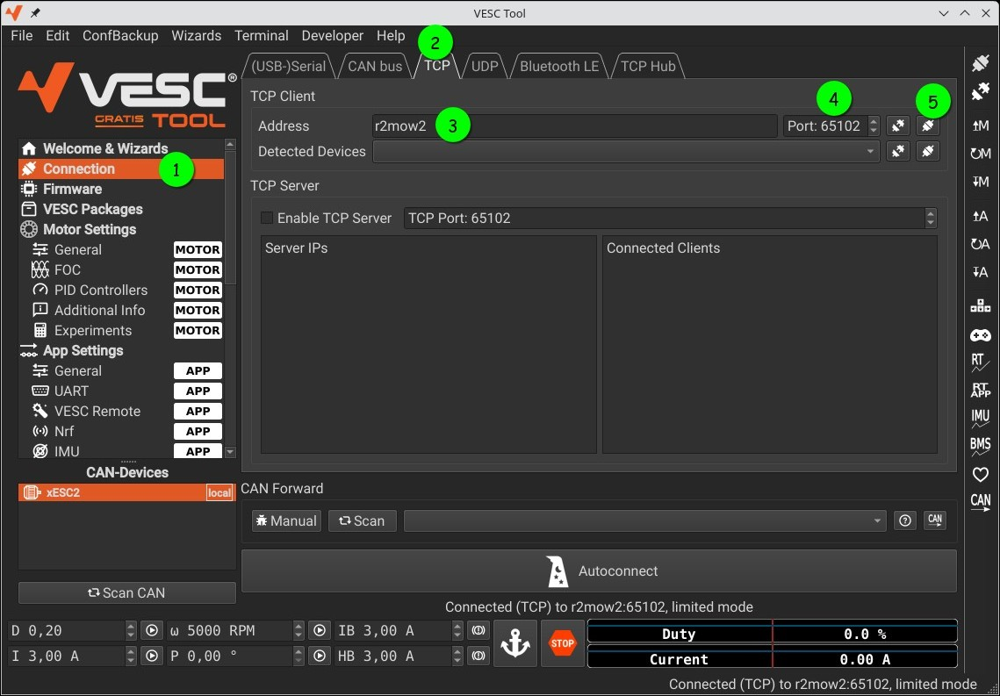<br>
   You'll probably get an "old firmware" warning, confirm it, it's harmless:<br>
   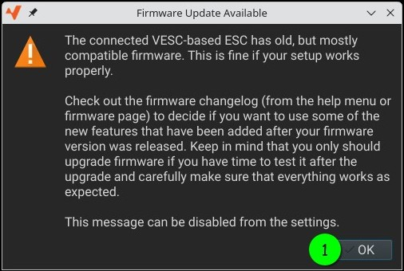

7. Enable realtime data: Later on, we wanna validate our calibration with a known reference value, but also during calibration it's interested to see the displayed values in the marked 2 window:<br>
   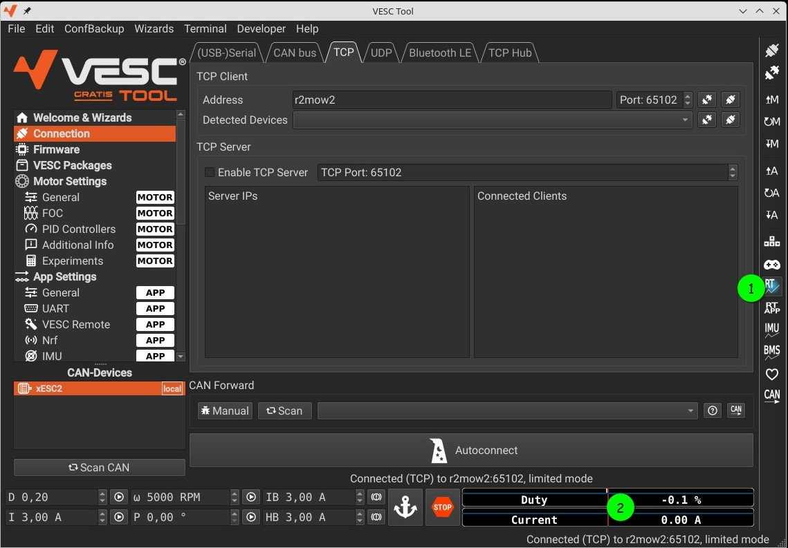
8. Start the FOC Calibration Wizard:<br>
   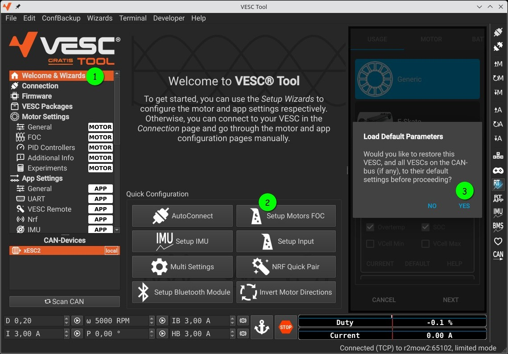<br>

   Now we need to provide some specs of our motor. **These are the specs for the left and right drive motors, for the mow motor, we need to use other specs**:<br>
   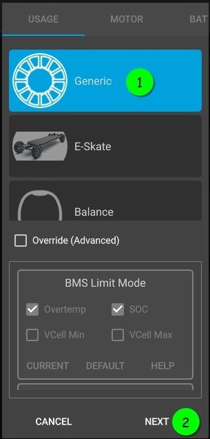 🡆 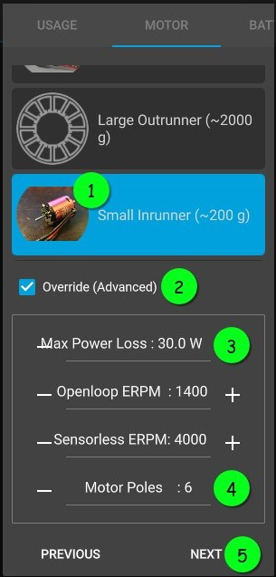 🡆 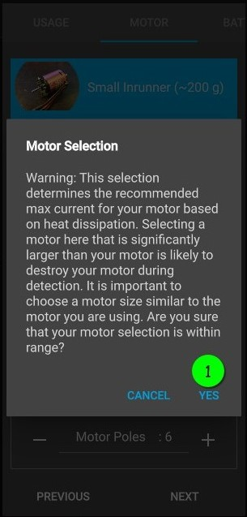<br>

   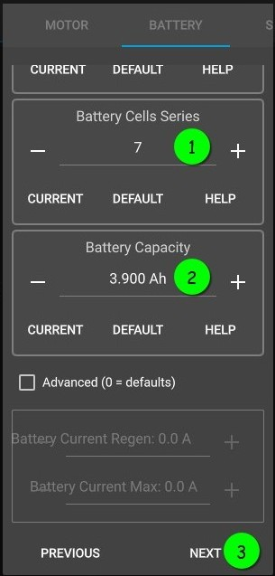 🡆 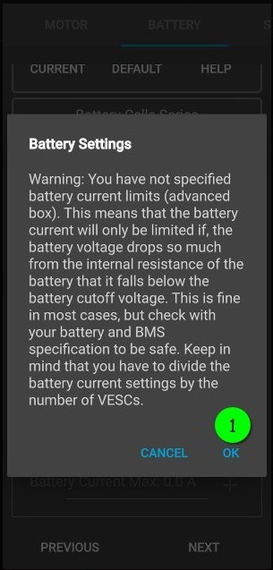 🡆 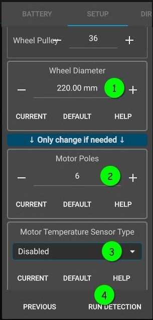<br>

   Once calibration has been done, **do not change the direction** (even though the left wheel turns forward during calibration, whereas the right one backwards):

   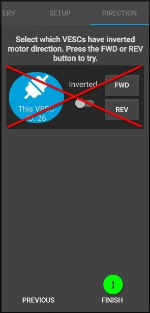
9. Now that the calibration succeed, lets test the result:
   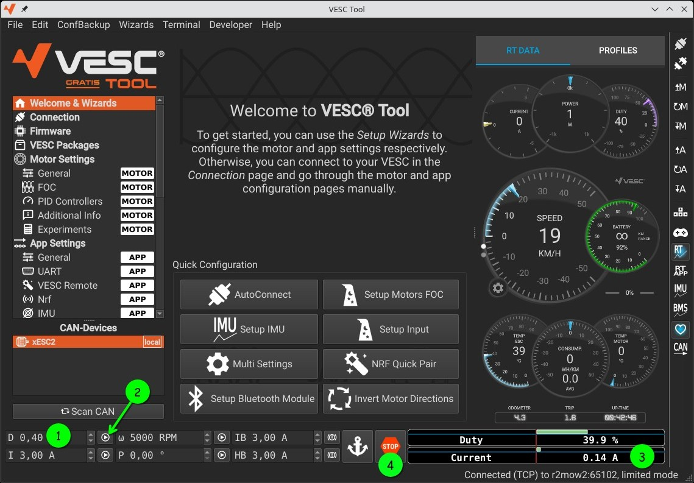<br>

   Test with "**D 0,4**" and press the "Duty cycle" play button. If it draw **<= 0.15A** and sound healty, it is calibrated well.<br>
   Test with some higher duty settings. It will become more loud for sure, but should always spin smooth and sound healty. If not, press the STOP sign.

10. As a last important step, load the correct ESC-App config via: _File → Load App Configuration XML_, choose `SABO_Drive-App.xml` (see [SABO ESCs configs](https://github.com/xtech/hw-openmower-sabo/tree/main/Configs/xESC)) and finally press the `↧A` icon (Write app configuration) on the right side.

11. Optional misc settings which you might align to be within the motor/battery specs:<br>
   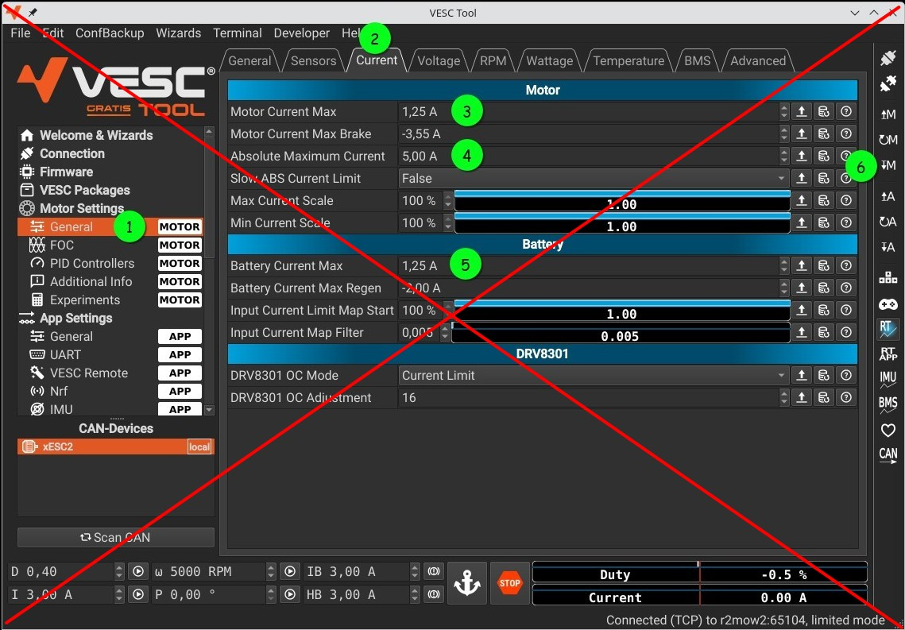

Done :satisfied:<br>
... **but not finished** :v: ... you need to do the whole procedure again, but with the right drive side.

So, <kbd>Ctrl</kbd>+<kbd>c</kbd> your socat, do it again but for port 65104 and start over at point 4. but with port 65104 to do the same for the right ESC


## Mow Motor Calibration

For the mow motor ESC calibration, you do the same workflow, but with adapted values:

1. socat/VESC connect port is 65103
2. During FOC Calibration Wizard use the following values:
   - Tab "Motor" = Medium Inrunner ~750g
     - Advanced: Max Power Loss = 200, Motor Poles = 8
   - Tab "Battery"
     - Battery Capacity = 3.9Ah (same as before)
   - Tab "Setup"
     - Gear Ratio = Check Direct Drive
     - Motor Poles = 8
     - Motor Temp. Sensor = disabled

3. Test with "**D 0,08**" which should draw **<= 0.52A** (without assembled blade)
4. Check/Adjust blade rotation direction:<br>
   We need to ensure that the blade rotate CCW (when watching from downside onto the axis). Do this with a slow rotation speed like "D 0,08".

   If it rotates CW, change direction via: _Motor Settings → General → Tab General → Invert Motor Direction_. **Do not forget to do: "Write motor configuration" via `↧M`**

5. Load the correct ESC-App config via: _File → Load App Configuration XML_, choose `SABO_Mower-App.xml` (see [SABO ESCs configs](https://github.com/xtech/hw-openmower-sabo/tree/main/Configs/xESC)) and finally press the `↧A` icon (Write app configuration) on the right side.

6. Limit blade RPM:<br>
   It's important to limit the max. RPM to the one like OEM is running it! Otherwise you risk your motor bearings or more dangerous: Your blade might fly away :skull:
   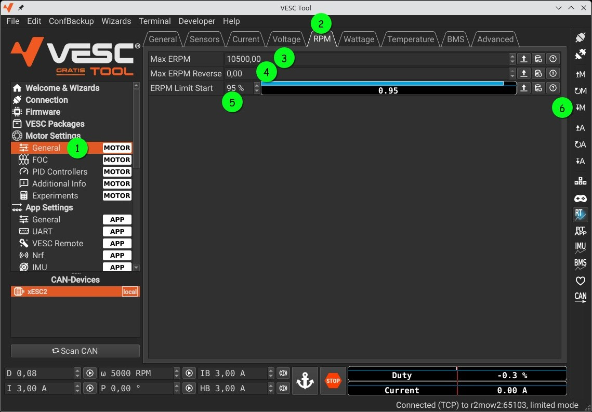

7. Optional misc settings which you might align to be within the motor/battery specs:<br>
   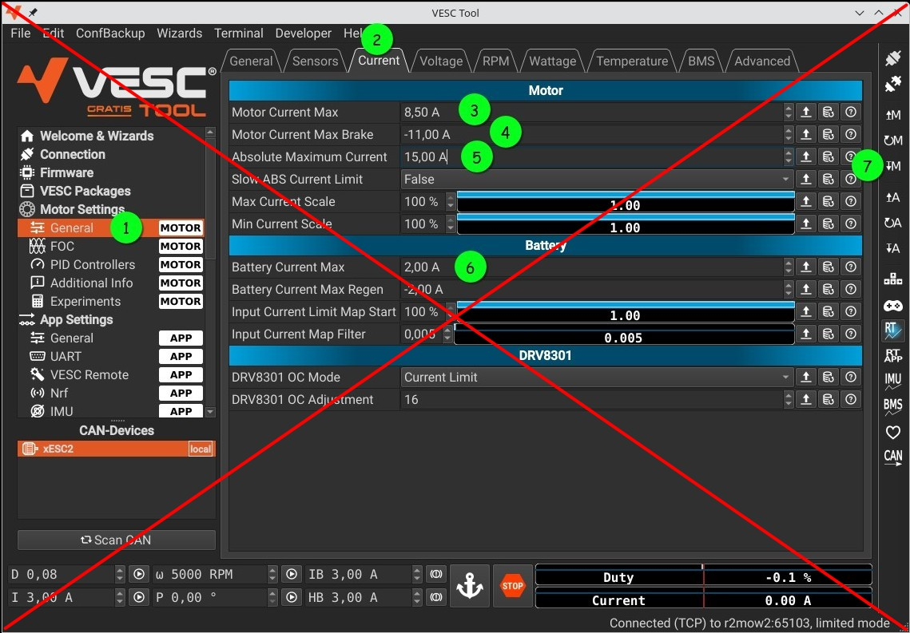

</details>

